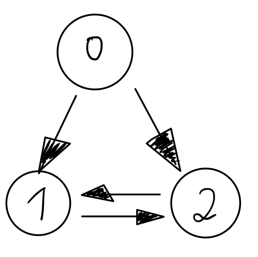

= Huge Graph Implementation Notes
Paul Horn <phorn@avantgarde-labs.de>
v1, 2019-01-21
:experimental:
:sectid:
:sectlinks:
:stem:
:toclevels: 3
:env-docs: true
:toc: left
:imagesdir: .

The HugeGraph can store and operate on graphs that exceed the theoretical limit of ~2 billion nodes. This document shows what techniques are used to achieve this and how we did arrive at the current implementation.

== HugeGraph Implementation

The explanation will follow a small three node graph

 (0)-->(1)
 (0)-->(2)
 (1)-->(2)
 (2)-->(1)

=== Initial concept, _heavy_ approach

We could store the target node of every relationship of a single node in an array, put those into another array for every source node and do this for outgoing and incoming respectively.

 nodeId:  0            1            2
 out:  [  [ 1, 2 ]  ,  [ 2 ]     ,  [ 1 ]     ]
 int:  [  [ ]       ,  [ 0, 2 ]  ,  [ 0, 1 ]  ]

==== Pros and Cons

While this works (in fact, it is similar to what the HeavyGraph implementation is doing), there are a number of problems to it.

* There are many objects -- small or even empty arrays -- created
* storage is non-sparse -- nodes without relationships occupy "`hole`"
* we're limited to Java arrays
** arrays are `int`-indexed, so we could never support graphs with more than 2B _(2^31^-1)_ nodes
** very large arrays need be committed to a consecutive chunk of memory, which the allocator might not be able to do, so we probably can't even support the 2B sized graphs

On the plus side, we can import to this in parallel fairly easy, if we import node by node.

=== Improving on GC issues, _light_ approach

Instead of creating extra arrays for every direction and every node, we can store _all_ relationship targets for every node in a single `int[]`. We also need an extra `int[numberOfNodes]` to store the offsets into the larger array, as we no longer have separate arrays.

``        nodeId:   *0*           `` +
``   out_offsets: [ *0*          ]`` +
`` out_adjacency: [ *1, 2*       ]`` +

``        nodeId:   0     *1*     `` +
``   out_offsets: [ 0,    *2*    ]`` +
`` out_adjacency: [ 1, 2, *2*    ]`` +

``        nodeId:   0     1  *2*  `` +
``   out_offsets: [ 0,    2, *3* ]`` +
`` out_adjacency: [ 1, 2, 2, *1* ]`` +

{sp} +

``        nodeId:   *0*              `` +
``    in_offsets: [ *0*             ]`` +
``  in_adjacency: [                 ]`` +

``        nodeId:   0  *1*           `` +
``    in_offsets: [ 0, *0*,         ]`` +
``  in_adjacency: [    *0, 2*,      ]`` +

``        nodeId:   0  1     *2*     `` +
``    in_offsets: [ 0, 0,    *2*    ]`` +
``  in_adjacency: [    0, 2, *0, 1* ]`` +

The adjacency list for any node `n` is the range of `**[**offset[n] : offset[n + 1]*)*`.
The degree is implicitly stores as `offset(n+1) - offset(n)`.
This was initially implemented as the `LightGraph` but has since been removed.

==== Pros and Cons

The approach no longer creates many small objects/arrays and it allows for sparse storage within the adjacency list--nodes without any relationship have the same offset as their next node. However, it comes with its own set of shortcomings and doesn't improve with the other aforementioned issues, even worsening them instead.

* As we now have a single large array for _all_ relationships, we can't even support graphs with more than a total of 2B relationships (the limit was just on the number of nodes before)
* The position and the values in the offsets array carries semantics, which means we must import every node one after the other and so we can no longer import into this graph in parallel (there are probably _some_ ways to do so, but it's no longer trivial).
** The degree and cutoff of the adjacency list depends on the fact, that the next entry in the offsets array is also the next node in the nodeId sequence

=== Supporting parallel import

Being able to import the graph with all threads doing meaningful work is an important factor, so we have to change the representation to allow for unordered writes.

We write the degree explicitly at the position where the offset value points at. To read the degree and the adjacency list, we no longer need to look at the values of the _next_ nodeId and it is no longer relevant that the n+1 id is actually the _next_ nodeId.

If we were to just write the degree, the adjacency list would no longer be sparse, as we would have to write a 0 for every empty node. Instead, we reserve the index `0` for all empty nodes to keep the sparsity property.

``        nodeId:      *0* degree`` +
``   out_offsets: [    *1* ] `` +
`` out_adjacency: [ __0__, *2* ] `` +

``        nodeId:      *0* adjacency`` +
``   out_offsets: [    1 ] `` +
`` out_adjacency: [ __0__, 2, *1, 2* ] `` +

{sp} +

``        nodeId:      0,       *2* degree`` +
``   out_offsets: [    1,       \_,  *4*] `` +
`` out_adjacency: [ __0__, 2, 1, 2, *1* ] `` +

``        nodeId:      0,       *2* adjacency`` +
``   out_offsets: [    1,       \_,  4] `` +
`` out_adjacency: [ __0__, 2, 1, 2, 1, *1* ] `` +

{sp} +

``        nodeId:      0,       2, *1* degree`` +
``   out_offsets: [    1,       *6*,  4] `` +
`` out_adjacency: [ __0__, 2, 1, 2, 1, 1, *1* ] `` +

``        nodeId:      0,       2, *1* adjacency`` +
``   out_offsets: [    1,       6,  4] `` +
`` out_adjacency: [ __0__, 2, 1, 2, 1, 1, 1, *2* ] `` +

{sp} +

{sp} +

``        nodeId:      *0* degree`` +
``   out_offsets: [    *0* ] `` +
`` out_adjacency: [ _0_ ] `` +

{sp} +

``        nodeId:      0,       *2* degree`` +
``   out_offsets: [    1,       \_,  *1*] `` +
`` out_adjacency: [ __0__, *2* ] `` +

``        nodeId:      0,       *2* adjacency`` +
``   out_offsets: [    1,       \_,  1] `` +
`` out_adjacency: [ __0__, 2, *0, 2* ] `` +

{sp} +

``        nodeId:      0,       2, *1* degree`` +
``   out_offsets: [    1,       *4*,  1] `` +
`` out_adjacency: [ __0__, 2, 0, 2, *2* ] `` +

``        nodeId:      0,       2, *1* adjacency`` +
``   out_offsets: [    1,       4,  1] `` +
`` out_adjacency: [ __0__, 2, 0, 2, 2, *0, 1* ] `` +

=== Removing the 2B constraint

In order to actually support huge graphs, we have to be able to store more than 2B relationships and more than 2B nodes. With the parallel light approach, we're limited by 2 int-indexed primitive arrays.

==== Paged data structures

To support long-indexed arrays, we use a paged long array. It is essentially a `long[][]` where the inner arrays are `long[]` pages of a fixed power-of-2-size. The _32-x_ most significant bits of an ID determine the index into to outer array of pages, the _x_ least significant bits the index into the particular page. The value of _x_ and therefore the page size depends varies between different use sites.

* For the array underlying the node-id mapping we at first try to allocate a single page for every node and fall back to a fixed page size of 16k, resulting in 128 KiB large pages.
* The reverse id-mapping always uses a fixed page size of 4096, resulting in 32 KiB large pages. This mapping allows for pages to be null if there are no values in those and is therefore using a smaller page size to make better use of this capability.
* A number of buffers that are used during importing will be paged based on the number of nodes and threads. The importer tries to use 4 pages per thread, so the target pageSize is defined as `nodeCount / (numberOfThreads * 4)` and then adjusted to fit within integer boundaries for the pageSize and the numberOfPages that are required
* The adjacency list itself used a page size of 2^18^ (262144), result in 256 KiB large pages, as the adjacency list actually uses ``byte[]``s as underlying storage, as described in the next chapter.

This will give us an theoretical upper limit of about 2^45^ (~35 trillion) nodes and 2^49^ (~562 trillion) relationships. Eventually, we want to have every page size to be dynamic, based on the same importer sizing calculation, which would given an upper limit of 2^62^ (~4600 quadrillion) values (nodes or relationships, respectively).

==== Reducing memory usage

If we take a graph with 1B nodes and 20B relationships, we'll need about 352 GiB of memory to store all the long values, and a bit more for all the extra arrays and objects. A lot of this data is unnecessary -- we store everything in 8 byte wide ``long``s but not every number actually requires the full 8 bytes and could be compressed somehow.

We don't apply any compression techniques for the offset list, as we require fast random access there.footnote:[Some compressions work better if we can stream the data -- even if it is just block-wise, but we could run the offset list through a fixed-width integer compression scheme, where every value is using only as many bits as is required to write the largest value.]

However, the adjacency list is read mostly in a iterating fashion. We jump to a starting point and then read value by value.
We could compress the data with a generic compression scheme like lz4 or use a dedicated integer compression, which is often more efficient and faster. Unfortunately, most of these work best if we have _a lot_ of integers to compress. While we do have a lot of numbers in the adjacency list, we can't compress them all as we still have to be able to jump at certain points. We will have to compress each adjacency list of every single node individually, at which point many compression schemes will add too much overhead.

We ended up going for a "delta-variable-long" compression, implemented as follows:

. Sort the input data (= adjacency list)
. Replace every value with its *delta* to the previous one (except for the first one)
. Write every long value byte-by-byte, using a *variable* number of bytes for each value (instead of always 8)footnote:varint[https://developers.google.com/protocol-buffers/docs/encoding#varints]
 * Use the most significant bit of every byte to indicate whether this is the last byte of a datum __(1)__ or if we have to read at least one more byte __(0)__
 * Use the remaining 7 bits to store the actual data
 * The number of required bytes is defined by link:https://www.wolframalpha.com/input/?i=log-linear+plot+Ceiling%5B(1%2F7)+(1+%2B+Floor%5BLog%5Bx%5D%2FLog%5B2%5D%5D)%5D,+x%3D1+to+2%5E63[stem:[ceil(1/7 (floor(log(x)/log(2)) + 1))]] instead of a constant 8

===== Example

Let's say, we have this adjacency list

 [ 251, 839, 378, 97, 13, 900, 818, 8, 776, 121 ]

First, we sort.

 [ 8, 13, 97, 121, 251, 378, 776, 818, 839, 900 ]

Then, we calculate the deltas

 [ 8-0, 13-8, 97-13, 121-97, 251-121, 378-251, 776-378, 818-776, 839-818, 900-839 ]
 [ 8  , 5   , 84   , 24    , 130    , 127    , 398    , 42     , 21     , 61      ]

To better show the effect of the variable-long (**vlong**) encoding, we switch to hex notation

 [
   0000_0000_0000_0008,
   0000_0000_0000_0005,
   0000_0000_0000_0054,
   0000_0000_0000_0018,
   0000_0000_0000_0082,
   0000_0000_0000_007F,
   0000_0000_0000_018E,
   0000_0000_0000_002A,
   0000_0000_0000_0015,
   0000_0000_0000_003D,
 ]

We currently require 80 bytes to store those 10 long values, so if we switch the storage to `byte[]`.

 [
   00, 00, 00, 00, 00, 00, 00, 00, 00, 00, 00, 08,
   00, 00, 00, 00, 00, 00, 00, 00, 00, 00, 00, 05,
   00, 00, 00, 00, 00, 00, 00, 00, 00, 00, 00, 54,
   00, 00, 00, 00, 00, 00, 00, 00, 00, 00, 00, 18,
   00, 00, 00, 00, 00, 00, 00, 00, 00, 00, 00, 82,
   00, 00, 00, 00, 00, 00, 00, 00, 00, 00, 00, 7F,
   00, 00, 00, 00, 00, 00, 00, 00, 00, 00, 01, 8E,
   00, 00, 00, 00, 00, 00, 00, 00, 00, 00, 00, 2A,
   00, 00, 00, 00, 00, 00, 00, 00, 00, 00, 00, 15,
   00, 00, 00, 00, 00, 00, 00, 00, 00, 00, 00, 3D,
 ]

Now we apply the vlong encoding. The first value `0x08` does fit into 7 bits (`<= 0x7F`) so we can write it with just one byte and set the MSB to `1`.

 [
   88,
   00, 00, 00, 00, 00, 00, 00, 00, 00, 00, 00, 05,
   00, 00, 00, 00, 00, 00, 00, 00, 00, 00, 00, 54,
   00, 00, 00, 00, 00, 00, 00, 00, 00, 00, 00, 18,
   00, 00, 00, 00, 00, 00, 00, 00, 00, 00, 00, 82,
   00, 00, 00, 00, 00, 00, 00, 00, 00, 00, 00, 7F,
   00, 00, 00, 00, 00, 00, 00, 00, 00, 00, 01, 8E,
   00, 00, 00, 00, 00, 00, 00, 00, 00, 00, 00, 2A,
   00, 00, 00, 00, 00, 00, 00, 00, 00, 00, 00, 15,
   00, 00, 00, 00, 00, 00, 00, 00, 00, 00, 00, 3D,
 ]

The same is true for the next three values.

 [
   88,
   85,
   D4,
   98,
   00, 00, 00, 00, 00, 00, 00, 00, 00, 00, 00, 82,
   00, 00, 00, 00, 00, 00, 00, 00, 00, 00, 00, 7F,
   00, 00, 00, 00, 00, 00, 00, 00, 00, 00, 01, 8E,
   00, 00, 00, 00, 00, 00, 00, 00, 00, 00, 00, 2A,
   00, 00, 00, 00, 00, 00, 00, 00, 00, 00, 00, 15,
   00, 00, 00, 00, 00, 00, 00, 00, 00, 00, 00, 3D,
 ]

The next value (`0x82 = 0b10000010`) requires two bytes. We split it in groups of 7 bits, starting from the least-significant ones ( `_**0000010**  _**0000001**` ) and set the MSB of every byte but the last one to `0` ( `**0**0000010  **1**0000001` ). 

 [
   88,
   85,
   D4,
   98,
   02, 81,
   00, 00, 00, 00, 00, 00, 00, 00, 00, 00, 00, 7F,
   00, 00, 00, 00, 00, 00, 00, 00, 00, 00, 01, 8E,
   00, 00, 00, 00, 00, 00, 00, 00, 00, 00, 00, 2A,
   00, 00, 00, 00, 00, 00, 00, 00, 00, 00, 00, 15,
   00, 00, 00, 00, 00, 00, 00, 00, 00, 00, 00, 3D,
 ]

Continue with the remaining values

 [
   88,
   85,
   D4,
   98,
   02, 81,
   FF,
   0E, 83,
   AA,
   95,
   BD,
 ]

We prefix this list with the uncompressed degree as a 4-byte integer:

 [ 00, 00, 00, 0A, 88, 85, D4, 98, 02, 81, FF, 0E, 83, AA, 95, BD ]

So, in the end we just need 16 bytes of memory for this adjacency list instead of the uncompressed 88 bytes, a reduction of ~80%.

The degree is only stored as a fixed-length unsigned integer, not compressed, as a compromise between memory requirements and decoding speed.

=== Parallel Importing

In order to import the adjacency list in parallel without having too much contention, we're using an allocation pattern that has been inspired by https://shipilev.net/jvm-anatomy-park/4-tlab-allocation/[TLAB] allocation.

There is a single, growing `byte[][]` that is written to by all importing threads. Instead of contenting for a write lock and moving the currently written-to page from CPU cache to CPU cache, each thread has a local allocator that will prefetch some number of pages and then this thread is the only one that write to these particular pages. The write lock is only for multiple allocators that are currently prefetching and will release as soon as a new page has been allocated.

Every importer writes the uncompressed adjacency list into a local buffer `long[]`. Once all relationships have been imported, the adjacency list is compressed and the number of required bytes is known. The allocator is asked for a slab of memory of the given size. If there is enough space in the local, prefetched paged, the allocation is essentially free and only the pointer for the top allocation address is bumped. 

If there isn't enough space, and the requested number of bytes fits into a single page, the allocator prefetches the next pages from the global pool and then allocates from the new page.

If the target size exceeds what can fit into a single page, we allocate a "`large page`". The allocator creates a new `byte[]` that will hold this very adjacency list but sets the offset/address as if the page was exactly _pageSize_ large. Since we only ever jump the the beginning of an adjacency list and not in the middle of one, the additional bytes don't mess up the paged offsets. This trick guarantees that every adjacency list will be in only one page and we don't have to bother with decoding the adjacency list across page boundaries.

=== Store Scanning

All importing steps thus far operate by node. That is, we go from node to node and read _all_ relationships for a single node in ine go. This is convenient for the importer &ndash; just import everything for this one node and continue with the next one &ndash; but it involves a lot of jumps in the underlying relationship store from Neo4j. With larger _(huge)_ graphs, the relationship store wouldn't fit the page cache and importing in this random-access fashion produces a lot of page faults und disk reads. To avoid this, we import the `HugeGraph` by scanning the relationship store instead of going node-by-node.

==== Adjacency buffering

With the scanning of the relationship store, the relationships aren't ordered by their source node, so we no longer know for sure when all targets for a single node have been imported. The worst case scenario is that we would have to store _all_ adjacencies in memory before we can compress them. There's likely not enough heap for that.

We could apply the same compression technique for the buffers as we do for the final adjacency list, but the target IDs aren't guaranteed to be increasing. The deltas we get can be negative and encoding a negative value with variable-length encoding results in a worst-case space usage -- every negative value always uses up 9 bytes.

To get around this problem, we first apply ZigZag Encoding footnote:zigzag[https://developers.google.com/protocol-buffers/docs/encoding#signed-integers] to the deltas.

ZigZag maps every signed value to an unsigned one where the absolute value is the smallest.

  0 -> 0
 -1 -> 1
  1 -> 2
 -2 -> 3
  2 -> 4

These values are then compressed using the aforementioned vlong technique. Once we have all targets of a particular node, we unwind the zig zag encoding and compress them into the actual adjacency list.

We read the relationship store in batches of about 100 (neo store) pages. The values are grouped by their source node id and then processed in bulk instead of operating on single relationships one by one.

==== Concurrency notes

The scanning of a store can happen in parallel. The number of threads to use also defines the page size

==== Precalculating degrees

NOTE: this feature is currently under development

Instead of having to wait until all values are loaded into memory, we load all degrees for every node before we start the scanning. This allows us to know when we will have all values for a node and we can flush the adjacency list and release the buffer memory for this node as early as possible.

The degrees are read during the Node importing, which is discussed in a following section.

== Node Import

Nodes are imported similarly to relationships -- the node store is scanned directly.
The importer scans the store pages in bulk (of 100 pages, as with the relationship store) and copies the
imported node ids into the HugeIdMap. This map is backed by a paged long-array.
The value of the array is the Neo4j Node id, the index is the internal graph id for this Node, thus mapping
the imported Ids to monotonically increasing values starting from zero.

This importing step happens in parallel, with each thread writing into the same backing array. The concurrent allocation happens guided by an atomic counter, pointing at the current top allocation point. A thread can reserve a certain number of values it wants to write an is given one or more slices of `long[]` arrays, each with s specific region that this thread is allowed to write to. Other regions of the same array may be written by other threads concurrently.

After importing all node id mappings (graph-id -> neo-id), a reverse map is built (neo-id -> graph-id). This mapping is backed by a sparse paged array instead of a map. The sparsity refers to he fact that single pages can be null if they contain no mapping and are thusly not consuming any memory. Further explanation can be found in the https://github.com/neo4j-contrib/neo4j-graph-algorithms/pull/392[Pull Request #392].

One downside of this reverse mapping is that it is done using only a single thread. The source data is the newly imported huge mapping, so no new data has to be read from disk, but it still happens only in a single thread.

== Class, Thread and buffer layout

While importing a huge graph

        GraphDimensions dimensions = this.dimensions;
        int concurrency = setup.concurrency();
        AllocationTracker tracker = setup.tracker;
        HugeLongArrayBuilder idMapBuilder = HugeLongArrayBuilder.of(nodeCount, tracker);
        NodesScanner.of(api, scanner, dimensions.labelId(), progress, idMapBuilder);
        HugeIdMap mapping = HugeIdMapBuilder.build(idMapBuilder, dimensions.allNodesCount(), tracker);
        
        HugeAdjacencyBuilder outAdjacency = new HugeAdjacencyBuilder(tracker);
        int weightProperty = dimensions.relWeightId();
        HugeWeightMapBuilder weightsBuilder = weightProperty == StatementConstants.NO_SUCH_PROPERTY_KEY
                ? new HugeWeightMapBuilder.NullBuilder(setup.relationDefaultWeight)
                : new HugeWeightMapBuilder(tracker, weightProperty, setup.relationDefaultWeight);

        new ScanningRelationshipsImporter(
                setup, api, dimensions, progress, tracker, mapping, weightsBuilder,
                LOAD_DEGREES, outAdjacency, inAdjacency, threadPool, concurrency)
                .call(setup.log);

        HugeWeightMapping weights = weightsBuilder.build();
        HugeGraph graph = HugeAdjacencyBuilder.apply(tracker, mapping, weights, inAdjacency, outAdjacency);

        progressLogger.logDone(tracker);
        return graph;

== Reading from the HugeAdjacencyList

The following steps are necessary to read an adjacency list for a given node

. get the offset into the adjacency list
 * This is a random access into a pages array and will return a `long` value
 * The special value `0` denotes an empty adjacency list
. open a cursor at the given offset
 * The HugeAdjacencyList can only be read with a cursor, which is doing the actual decoding
 * Cursors have some local buffers and can be reused
 ** They are so by default for any _huge_ API, that is, the ones that are accepting and operating on `long` ids, not on __int__s
 *** This makes the HugeGraph thread-**un**safe and one has to get a thread-local copy using the `#concurrentCopy()` method.
 ** The APIs from the `Graph` interface are implemented differently -- they don't reuse cursors and allocate a new one on every iteration
 *** The `Graph` interface has no _copy_ equivalent, so there would be no way to use the `HugeGraph` in a thread-safe manner
. read 4 bytes, this will be the degree and also the limit for how many targets the cursor will read before being exhausted
. the cursor decodes 64 values at once ("`block`") and the first block is decoded
. reading the next value returns the next value from the block, if we still have some decoded footnote:[We don't have the API for this (yet), but we could hand the array to the iteration consumer so that they may process values in batches instead of having to call for every single next value.]
. otherwise, we decode the next block and continue
. skipping over values (`HugeIntersect`) also can skip over full blocks if the last value is out of range
 * We still have to decode the values, though
